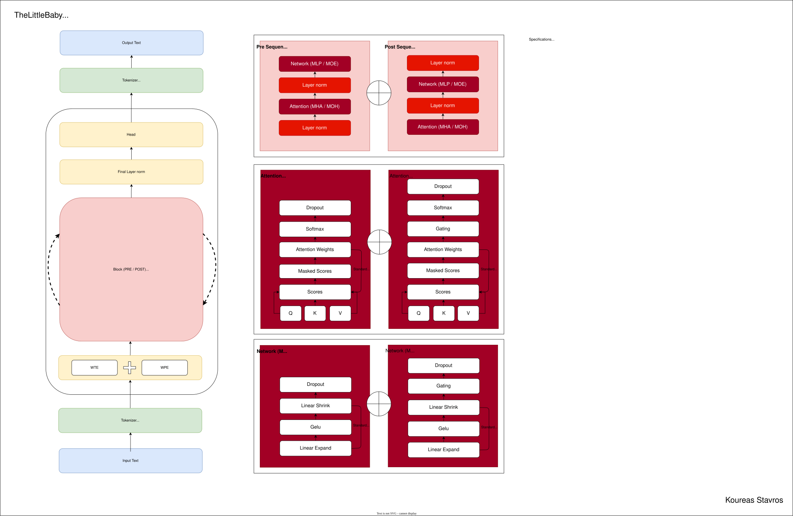
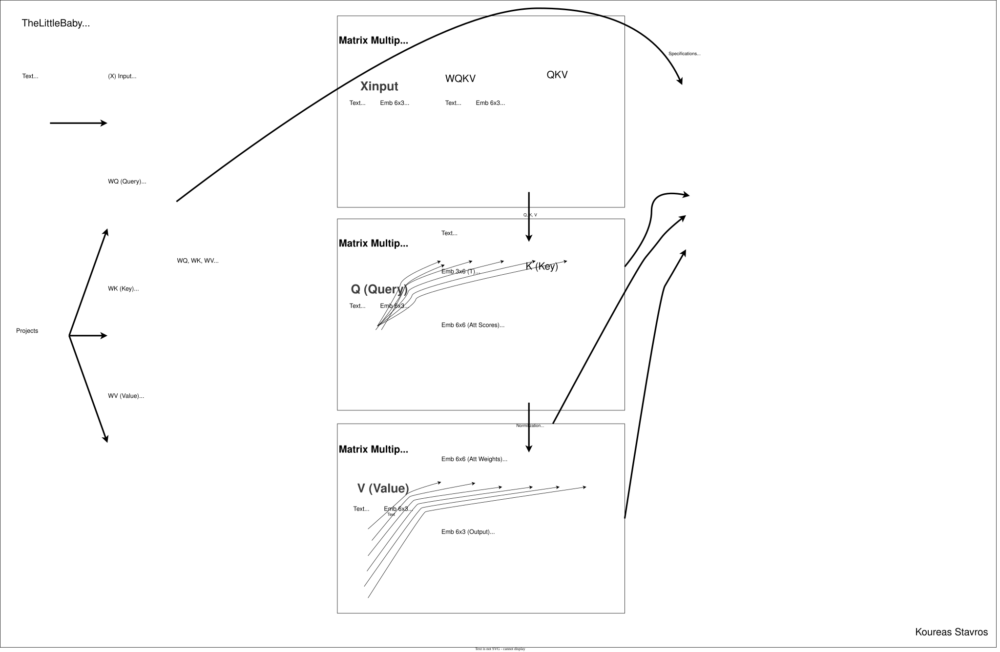
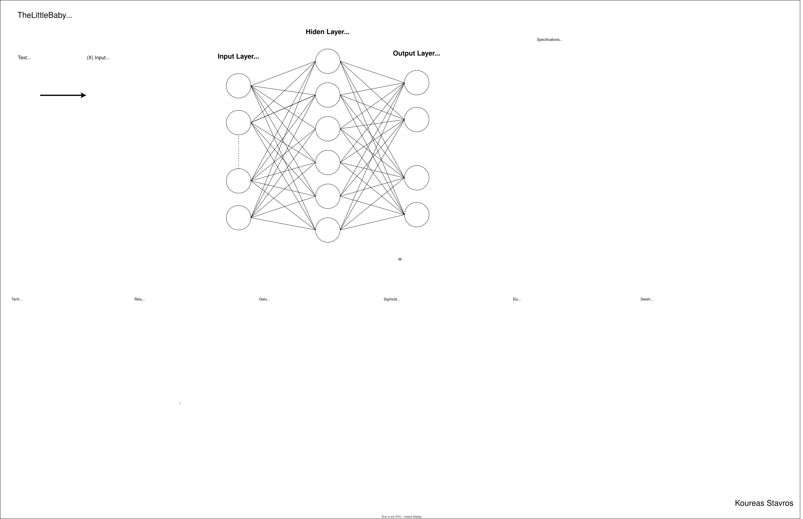

# 👶 The Little Baby

  - A barebones GPT-style LLM implementation — pure Python, zero dependencies.


## 🧠 Description

**The Little Baby** is a minimalist language model (LLM) crafted entirely in **pure Python using just Numpy / CuPy**. It requires no external packages, libraries, or frameworks to function. Both **training** and **inference** are achieved through low-level operations and hand-built logic — making this project ideal for educational deep dives and experimental tinkering.

This repository is designed to reveal the **inner mechanics** of a GPT-style transformer model and demystify the "magic" behind modern language models through readable and hackable code.


## 🎯 Audience

This project is perfect for:
- Curious learners wanting to dissect how GPTs work from the ground up.
- Researchers experimenting with primitive architectures.
- Engineers exploring early-stage LLM behaviors.
- Anyone who enjoys coding like it's 2010 — no imports, just raw power.


## 🌟 Inspiration

This project draws its spark from modern titans in the world of machine learning:

- **Sebastian Raschka** — acclaimed for his lucid teaching style and groundbreaking contributions to deep learning, making complex concepts accessible to learners and practitioners alike.
- **Andrej Karpathy** — influential in shaping the landscape of computer vision and generative models, while championing open-source AI education that empowers a global community of developers.
- **Yann Dubois** — instrumental in designing scalable evaluation frameworks for large language models, notably AlpacaEval and AlpacaFarm, which bring automation closer to the nuance of human feedback.

Their work inspired the spirit of transparency, curiosity, and simplicity that fuels *The Little Baby* — a model built not for production, but for understanding.

  - “Build it, break it, learn from it.” – The Baby Philosophy


## 🚀 Project Goals

This endeavor is structured around key targets designed to deliver meaningful outcomes:

- ✅ Build a GPT-like model using **only Python + NumPy-like constructs**.
- ✅ Support training from scratch on plain text files.
- ✅ Provide clear code for attention mechanisms, tokenization, and backprop.
- ✅ Encourage experimentation and modification.


## 📚 Directory Files

Each run generates some unique files, identified by a GUID tag. These files capture different aspects of the model's execution:

- **⚙️ Config Snapshot**  
  `configs/config_<GUID>.json`  
  A config file containing the configuration of the each iteration.

- **🧠 Model Snapshot**  
  `models/model_<GUID>.json`  
  Model object including learned weights, biases, which are the internal parameters.

- **🔤 Tokenizer Snapshot**  
  `tokenizers/tokenizer_<GUID>.json`  
  Tokenizer object including vocabilary of the input data and their positioning.

- **📝 Report Output**  
  `outputs/report_<GUID>.json`  
  A comprehensive log containing training analysis, and performance metrics.

- **🗣️ Completion Output**  
  `outputs/completion_<GUID>.json`  
  The raw generated text from the model's inference — your baby’s words in print!


## 🚼 Next Steps

Let’s keep The Little Baby alive — and help it grow into a full-blown member of the NumPy family!

This means:

- 📈 Evolving from hand-crafted loops to efficient vectorized operations.
- 🧮 Embracing numerical abstractions while maintaining full transparency.
- 🛠️ Exploring performance tricks, batch parallelism, and experimental features.
- 🧬 Bridging the gap between simplicity and capability — one token at a time.

The journey from babbling to brilliance starts here. Let's raise this little one right!


## ⚖️ License Summary

You're free to:

- ✅ **Use it** for any purpose — personal, educational, or commercial  
- 💡 **Suggest ideas** and contribute improvements  
- 🍴 **Fork it** and build upon the code  
- 💰 **Sell it** or use it in a product

As long as:

- 📌 You **reference the original author and project** clearly in any public distribution or commercial use


## 👨‍👩‍👧 Credits

The Little Baby owes its lineage to two brilliant minds in the AI family tree:

- 👑 **Ownser**: Koureas Stavros | Product Architect BI / AI — lovingly crafted and cared
- 🧔 **Father**: OpenAI GPT 4.1 — provider of deep generative DNA and thoughtful token flow  
- 🧑‍🍼 **Mother**: Google Gemini 2.5 — donor of wide context windows and clever architectural chromosomes
- 🧙 **Godparent**: Claude Sonnet 4.0 — gentle guide and lifelong companion, whispering wisdom and weaving clarity

Together, they gifted the foundational strands that allowed this little one to generate helpful code and take its first linguistic steps.

## 📋 Prerequisites

The Little Baby doesn’t ask for much—just a few cozy things to get started:

- If you're using the CPU, make sure NumPy is tucked into your Python environment. If it’s missing, you can gently place it there yourself. But don’t worry—if you forget, Little Baby will wiggle its fingers and install it for you.
- If you're using the GPU, then CuPy is the magic blanket Little Baby needs. If it’s not already there, you can wrap it in manually. Otherwise, Little Baby will try to knit it from scratch—but that takes time, because it has to match your CUDA version perfectly. If you want to help Little Baby wake up faster, you can give it the right CuPy-CUDA library directly.

## 🧪 Instructions
To get started with this project, clone the code, download the tokenizers abd pre-trained models if needed, and follow the setup steps below to run the notebook and select your desired configuration.

**Get objects**
  - You can access the code on GitHub (https://github.com/koureasstavros/TheLittleBaby), simply clone the repository.
  - You can access the pre-trained tokenizers and models on Hugging Face (https://huggingface.co/koureasstavros/TheLittleBaby), simply download the config, tokenizer and model files. In case you have low speed internet connection check the analysis table select a guid and pick a specific guid for config, tokenizer and model. The config, tokenizer and model files are needed only if you are going to perform finetune or inference without training your own.
  - Then, you should:
    - place the config file or config files into the configs folder.
    - place the tokenizer file or tokenizer files into the tokenizers folder.
    - place the model file or model files into the models folder.

**Configure Environment**
  - Based on the environment different posibilities and features are available
    - If you are running localhost then you can choose to process on CPU or GPU
      - If you select gpu make sure that you know if your system supports cuda or tensor
    - If you are running on a cloud provider you need to know certain things
      - If you select Google Colab with GPU, make sure that you specify the proper cuda version based on selected gpu, because Google Colab seems that cannot build of wheels for gpu because it does not exposes the nvcc and therefore if you keep cuda version to auto it will hung.
      - If you select Kaggle with GPU, make sure that you specify the proper cuda version on selected gpu, because it will take realy lot of time to build wheels with cuda version auto, in addition there is different path for reading uploaded files with read only permission and different path for output files that has write permission.

**Start the Notebook**
  - Open the `.ipynb` file in a Python kernel (e.g. Jupyter, VS Code, Colab).
    - Run all cells in the notebook

**Select Path**
  - Choose the relative path between ipynb and folders:
    - `same`, if the notebook is into the same path with folders
    - `<path>`, if the notebook is into different path than the folders

**Select Plan**
  - Choose one of the following plan modes:
    - `train`, to train a new model (based on settings file)
    - `finetune`, to finetune a pre-trained model
    - `inference`, to inference using a pre-trained model
    - `delete`, to delete all relative files of a pretrained model
    - `info`, to get only information of a pretrained model

That's it!


## 🔮 What to expect

In Baby's world, each option has its own little job—and below, you’ll discover what each one does and the cuddly objects it gives back in return.

#### 🔧 Train
- Begins training using parameters defined in earlier Python blocks.
- A config file containing the settings will be generated with format `config_<guid>`.
- A tokenizer file containing the vocabilary will be generated with format `tokenizer_<guid>`.
- A model file containing the weights and biases will be generated with format `model_<guid>`.
- A report file containing the training analysis will be generated with format `report_<guid>`.
- A completion file containing the generation will be generated with format `complation_<guid>` using an empty prompt.

#### 🛠️ Finetune
- Begins finetuning using a **base model** and a **custom training dataset**.
- Requires the **GUID** of the base to locate `config_<guid>`, `tokenizer_<guid>` and `model_<guid>`.
- A tokenizer file containing the vocabilary will be generated with format `tokenizer_<guid>_fineuned`.
- A model file containing the weights and biases will be generated with format `model_<guid>_finetuned`.
- A report file containing the training analysis will be generated with format `report_<guid>_fineuned`.
- A completion file containing the generation will be generated with format `completion_<guid>_finetuned` using an empty prompt.

#### 💬 Inference
- Requires the **GUID** of the trained model to find the `config_<guid>`, `tokenizer_<guid>` and `model_<guid>`.
- You must also provide a **prompt** for the model inference to respond to, if not leave empty to continue on trained text.
- A completion file containing the generation will be generated with format `completion_<guid>_<yyyymmddhhmmss>` using the prompt.

#### 🗑️ Delete
- Requires the **GUID** of the trained model to find the `config_<guid>`, `tokenizer_<guid>` and `model_<guid>`.
- The files `config_<guid>`, `tokenizer_<guid>`, `model_<guid>`, `report_<guid>`, `complation_<guid>` will be deleted

#### ℹ️ Info
- Requires the **GUID** of the trained model to find the `config_<guid>`, `tokenizer_<guid>` and `model_<guid>`.
- An output with information will be provided.

After lot of hours of training on a single document of multiple Shakespeare works using a **laptop CPU**, The Little Baby learns to babble. Its speech is primitive and childlike — just enough to make you smile and realize… the baby is alive. While its capabilities are minimal, its structure is maximal in transparency. Every token, gradient, and parameter is visible and malleable.

*Keep in mind that if you're running a process in VSCode and your workstation, PC, or laptop enters hibernation, the process will resume automatically once the device is powered back on.


## 🍼 Cry. Babble. Speak. Repeat.

Here come the smartest little settings to help the model learn and grow big and strong from this data:

- **Age 3 Months** - 33bd6583-1b87-4469-b55e-0ccb8fd0441c - Coos and gurgles begin. Sound, not speech—yet something’s brewing.
- **Age 6 Months** - 180eeb27-b1b4-4427-9734-c70e10da2005 - Loud, random cries. It’s not talking, but it's definitely expressive.
- **Age 12 Months** - 5f13a2ab-113a-4c2c-8abd-40384bdd8854 - Joyful noise with hints of intention. Real words still warming up.
- **Age 24 Months** - cb632ce3-3f3b-432b-b24f-9171005f205e - Words arrive —Chaotic, quirky, delightful. Syntax? Optional.
- **Age 48 Months** - 12b8b053-6c14-42aa-a957-89b809e6f785 - Mini Philosopher Mode -Stories, opinions, even jokes. Communication unlocked.hear them.

*Keep in mind that these are pre-trained model executions available for finetune or inference. You can bypass the training phase by simply downloading the models and using them directly.

## ⚙️ Parameters

These hyperparameters collectively define the training process, where a model's architecture—specified by its depth (n_layers), width (n_emb), attention span (n_ctx), and attention mechanism (n_heads, head_size)—is optimized over a set number of num_epochs using a specific batch_size and learning rate (lr), with dropout applied to improve generalization.

- **c_device**

  - Values: cpu, gpu
  - What it is: Specifies the hardware device used for executing model operations—either the central processing unit (cpu) or the graphics processing unit (gpu).
  - Size: While it doesn’t directly affect parameter count, it can influence model deployment size due to differences in memory handling and batch processing capabilities.
  - Speed: While it doesn’t directly affect parameter count, it significantly impacts model speed—gpu enables faster parallel computation, whereas cpu is better suited for lightweight or sequential tasks.
  - Quality: Device choice doesn’t alter model accuracy, but slower execution on cpu may affect responsiveness in real-time applications, while gpu allows for more efficient training and inference cycles.

- **c_device_cpu_cores**

  - Values: [1, *]
  - What it is: Specifies the number of CPU cores available for executing model operations.
  - Size: Doesn’t directly affect model parameter count, but may influence memory allocation and parallel processing capacity.
  - Speed: More cores can improve throughput for preprocessing and lightweight inference tasks, though still slower than GPU for deep learning workloads.
  - Quality: No direct impact on model accuracy, but limited cores may reduce responsiveness in real-time or multi-threaded environments.

- **c_device_gpu_core**

  - Values: [0, *]
  - What it is: Identifies the specific GPU core or device used for model execution.
  - Size: Doesn’t change model parameters, but selecting a more powerful GPU can enable larger batch sizes and more complex models.
  - Speed: Affects execution speed depending on the GPU’s architecture, memory bandwidth, and compute capability.
  - Quality: Indirectly improves training and inference quality by enabling faster iteration and better resource utilization.

- **c_device_gpu_tensor**

  - Values: [0, 1]
  - What it is: Refers to the tensor-level operations executed on the GPU, typically involving matrix multiplications and attention mechanisms.
  - Size: Doesn’t alter parameter count, but efficient tensor handling allows for larger models and more scalable training.
  - Speed: Critical for accelerating deep learning workloads; optimized tensor operations dramatically reduce training and inference time.
  - Quality: Enhances model performance by supporting high-throughput computation, especially in large-scale or multi-modal architectures.

- **c_tokenizer**

  - Values: [char]
  - What it is: Strategy for tokenizing sequences.
  - Size: While it doesn’t directly affect parameter count, it does influence model size due to differences in vocabulary structure.
  - Speed: While it doesn’t directly affect parameter count, it does influence model speed due to differences in vocabulary structure.
  - Quality: When texts contain errors, it can negatively affect training and inference quality.

- **c_sequence**

  - Values: [pre, post]
  - What it is: Strategy for constructing block sequences.
  - Size: No direct impact on parameter count.
  - Speed: No direct impact on performance.
  - Quality: Proper sequence construction affects how well long dependencies are exposed. Future variants could improve learning efficiency on heterogeneous corpora.

- **c_attention**

  - Values: [mha, moh, gqa, swh, aft]
  - What it is: Chosen attention mechanism implementation.
  - Size: Attention choice impacts model size. 
  - Speed: Attention choice impacts model speed.
  - Quality: Attention choice influences how diverse relational patterns are captured.

- **c_network**

  - Values: [mlp, moe, lor, swi, nft]
  - What it is: Chosen network mechanism implementation.
  - Size: Network choice impacts model size. 
  - Speed: Network choice impacts model speed.
  - Quality: Network choice impacts representational richness and efficiency.

- **n_ctx**

  - Values: [8 : ****]
  - What it is: The maximum number of tokens (characters, in this case) the model can look at in a single sequence to make a prediction. It's the model's "attention span".
  - Size: Directly increases the size of the positional embedding table (n_ctx x n_emb), adding more parameters to the model.
  - Speed: Has a major impact. The self-attention mechanism's computation grows quadratically with the context length (O(n_ctx²)). Doubling n_ctx will roughly quadruple the time and memory needed for the attention layers, making it one of the most expensive parameters to increase.
  - Quality: A larger n_ctx allows the model to learn longer-range dependencies in the text, which can significantly improve quality for tasks that require understanding context over long passages.

- **n_emb**

  - Values: [8 : ****]
  - What it is: The size of the vector used to represent each token. It defines the "width" of the model.
  - Size: Has a major impact on model size. It increases the size of token and positional embeddings, and scales the weight matrices in the attention and MLP layers, significantly increasing the total parameter count.
  - Speed: Increasing n_emb increases the size of nearly all weight matrices in the model. This leads to more parameters, which increases both memory usage and the time required for matrix multiplications. The impact is significant but generally more linear than n_ctx.
  - Quality: A larger n_emb gives the model more capacity to learn rich, complex representations of tokens and their relationships. This can lead to a more powerful and accurate model, but also increases the risk of overfitting if the model is too large for the dataset.

- **head_size**
  
  - Values: [8 : ****]
  - What it is: The total dimensionality of the concatenated attention heads. This dimension is projected from the input embedding (n_emb) to create the Query, Key, and Value matrices.
  - Size: Directly increases the number of parameters in each attention block by defining the size of the Q, K, V, and output projection matrices.
  - Speed: Directly affects the size of the Q, K, and V projection matrices. A larger head_size increases the number of computations and memory usage within each attention block.
  - Quality: A larger head_size gives the model more representational power within the attention mechanism. It must be divisible by n_heads.

- **n_heads**

  - Values: [1 : ****]
  - What it is: The attention mechanism is split into multiple "heads" that perform attention calculations in parallel. Each head can learn to focus on different types of relationships in the data.
  - Size: Has no direct impact on model size, as it only determines how the head_size dimension is partitioned for parallel computation.
  - Speed: The computations for each head can be parallelized. On capable hardware, increasing the number of heads might not slow down training significantly if the head_size is kept constant.
  - Quality: Allows the model to simultaneously attend to information from different representation subspaces at different positions. This is a core concept of the Transformer and generally leads to a much better model than a single attention head.

- **n_layers**

  - Values: [1 : ****]
  - What it is: The number of Transformer blocks stacked on top of each other. This defines the "depth" of the model.
  - Size: Has a direct, linear impact on model size. Each layer adds a block with attention layers and network layers.
  - Speed: The impact is linear. Doubling n_layers will roughly double the training time and the number of model parameters, as the input data must pass through each block sequentially.
  - Quality: More layers allow the model to learn more complex and abstract features. Deeper models are generally more powerful, but also more prone to overfitting and can be harder to train (though residual connections help mitigate this).

- **m_epochs**

  - Values: [1 : ****]
  - What it is: The number of times the training process will iterate over the entire training dataset.
  - Size: Has a direct, linear impact on model size. Each layer adds a complete set of Transformer block parameters, roughly doubling the model's core parameter count if you double the layers.
  - Speed: Directly and linearly impacts total training time. More epochs mean longer training.
  - Quality: Too few epochs will lead to an undertrained model (underfitting). Too many can lead to the model memorizing the training data (overfitting), which hurts its performance on new data. The ideal number is usually found by monitoring the validation loss.

- **batch_size**

  - Values: [1 : ****]
  - What it is: The number of training sequences (each of length n_ctx) processed in one forward/backward pass.
  - Size: Has no impact on the number of parameters in the model.
  - Speed: A larger batch_size allows for more parallelization, generally leading to faster training (fewer updates per epoch). However, it also requires more memory.
  - Quality: This is a trade-off. Larger batches provide a more accurate and stable gradient estimate, but the noise from smaller batches can act as a regularizer, helping the model find a better minimum and generalize better.

- **r_dropout**

  - Values: [0.1 : 0.001]
  - What it is: A regularization technique where a fraction of neuron activations are randomly set to zero during each training step. This prevents the model from becoming too reliant on any single neuron.
  - Size: Has no impact on the number of parameters in the model.
  - Speed: Has a negligible impact on training speed and no impact on inference speed (it's disabled during evaluation).
  - Quality: Crucial for improving model generalization and preventing overfitting. By forcing the network to learn redundant representations, it makes the model more robust. The value (e.g., 0.1) is the probability of a neuron being dropped.

- **r_learn**

  - Values: [0.1 : 0.0001]
  - What it is: Controls how much the model's weights are adjusted with respect to the loss gradient. It determines the step size at each iteration.
  - Size: Has no impact on the number of parameters in the model.
  - Speed: Affects the speed of convergence. A higher learning rate might converge faster, but risks overshooting the optimal weights. A lower earning rate is more stable but can be very slow to converge.
  - Quality: This is one of the most critical parameters. If it's too high, the training can become unstable and diverge. If it's too low, the model may get stuck in a suboptimal solution or take too long to train. The AdamW optimizer helps adapt the learning rate, but the initial value is still very important.

- **s_warmup**
  - Values: [none, auto, 1 : 0.0001]
  - What it is: Controls how much the model's steps are contributing to the training weights based on proportional learning rate.
  - Size: Has no impact on the number of parameters in the model.
  - Speed: Affects the speed of convergence based on proportional learning rate.
  - Quality: This is one of the most critical parameters. If it's too high, the optimizer will process high number of steps until it reaches the full learning rate. If it's too low, the optimizer will process a few number of steps until it reaches the full learning rate. 


## 📐 Formulas

Even our little language models have their favorite rules to follow—turns out, they quietly cuddle up to some clever mathematical formulas that help them make sense of the world.

- **Learning Rate**

  ```LR_new = LR_old * (B_new / B_old)```

  New Learning Rate (LR_new) is based on Old Learning Rate (LR_old), New Batch size (B_new), Old Batch size (B_old).

- **Total Parameters**
  ```
    P = V × H                                  # token embeddings
      + L × [ 3 × H × H                        # Q, K, V projections
            + H × H                            # output projection from attention
            + 4 × H × F                        # feedforward up-projection
            + 4 × F × H                        # feedforward down-projection
            + biases (small) ]
  ```

  Total parameters are based on Vocabilary Size (V), Head Size / Embedding Size (H), Layer Number (L), Feedforward intermidiate Size (F).

- **Token Thoughput for training**

  ```T = 20-40 per P```

  Token number processed per Parameter (P) is 20-40.

- **Flops Thoughput for training**

  ```F = 6 * T * P```

  Flops are based on 6 (2 ops for forward pass and 4 ops for backward pass), Number of Tokens (T), Number of Parameters (P).

- **Memory for training**
  ```
    4GBM = batch_size=4, n_ctx=128, n_emb=128, n_layers=4
    8GBM = batch_size=4, n_ctx=256, n_emb=128, n_layers=4
    16GBM = batch_size=4, n_ctx=512, n_emb=128, n_layers=4
    8GBM = batch_size=8, n_ctx=128, n_emb=128, n_layers=4
    16GBM = batch_size=16, n_ctx=128, n_emb=128, n_layers=4
  ```


## 🏛️ Architecture

A language model architecture is a combination of attention and a neural network design—often based on transformers—that processes and generates human-like text by learning patterns from large-scale language data.



### 👁️ Attention Variants Complexity Table

Attention mechanism helps a language model decide which words (or tokens) in a sentence are most relevant when generating or interpreting another word. It’s like giving the model a spotlight to focus on the most important parts of the input.



| Variant | Uses Q/K/V? | Complexity | Notes | Details |
|--------|--------------|------------|------------|------------|
| **MHA** (Multi-Head Attention) | Separate Q, K, V per head | **O(B·T²·H·d_k)** | Standard Transformer attention; expensive for long sequences | Standard full multi‑head attention. |
| **MOH** (Multi-Output Head) | Typically uses Q/K/V | **O(B·T²·H·d_k)** | Less common; focuses on output diversity rather than input projection | Full QKᵀ for all heads + softmax gating over heads. |
| **GQA** (Grouped-Query Attention) | Shared K/V per group of Q heads | **O(B·T²·Hkv·d_k) with Hkv < Hq** | Trade-off between performance and efficiency | Full QKᵀ but with fewer K/V heads (shared across Q groups). |
| **SWH** (Sliding Window Attention) | Uses Q/K/V within local window | **O(B·T²·H·d_k)** | Limits attention to nearby tokens; efficient for long sequences | Full QKᵀ per head but only one head output is used per token (top‑1 gating). Still computes all heads. |
| **AFT** (Attention-Free Transformer) | No K/V; uses learned positional bias | **O(B·T·D)** | Removes attention entirely; uses element-wise operations and bias terms | Only k_proj, v_proj, elementwise exp/clip, cumsum, division, c_proj. No QKᵀ. |
| **LDA** (Linear Diagonal Attention) | Shared Q/K; diagonal-only interaction | **O(B·T·D)** | Lightweight attention using only diagonal of QKᵀ; fast and memory-efficient | Computes only Qᵢ·Kᵢ for each token *i* (no pairwise attention); often gated with sigmoid or swish. |

### 🕸️ Network Variants Complexity Table

Neural network is a system of interconnected nodes (called neurons) inspired by the human brain. In language models, these networks process text data by passing it through multiple layers, each transforming the input in increasingly abstract ways.



| Variant | Complexity | Notes | Details |
|--------|------------|------------|------------|
| **MLP** (Multilayer Perceptron) | **O(N × D²)** | Dense feedforward layer; all inputs pass through the same network | 1 large expansion projection + 1 down projection + GELU + dropout. |
| **MOE** (Mixture of Experts) | **O(K × D²)** (K ≪ N) | Sparse routing to K of N experts; improves parameter-to-compute ratio and scalability | Gating projection + all experts computed every time (dense MOE) → many large projections per forward. |
| **LOR** (Low-Rank Adaptation) | **O(N × rD)** where *r* ≪ *D* | Efficient fine-tuning by injecting low-rank matrices into frozen weights | 1 frozen full projection + 2 small low-rank projections (rank ≪ D) + dropout. |
| **SWI** (Shifted Window Interaction) | **O(N·w)** where *w* is window size | Local windowed processing with shifted regions; avoids global attention | 2 full projections up to expanded dim + 1 down projection, with swish gating. |
| **NFT** (Network Free Transformer) | **O(N × D)** | Attention-free mechanism that converts features into discrete tokens; useful for structured or multimodal data | 3–4 linear projections (q_proj optional) + elementwise ops + cumsum (O(B·T·D)), no QKᵀ, no expansion. |
| **LIN** (Linear Instant Network) | **O(N × D)** | Lightweight feedforward alternative; fast and interpretable | 1 linear projection + 1 gating projection (sigmoid or swish) + elementwise product; no expansion, no dropout. |

## 🗄️ Data Sets

These are the special learning blocks that help little baby grow smart and curious!

| dataset | description |
|-----|-----|
| shakespeare | works into a single document of 32777 paragraphs, 35558 sentences, 202651 words, 1075394 characters / tokens for learning and 500 characters / tokens for inference |
| sophocles | works into a single document of 8879 paragraphs, 2597 sentences, 1135 words, 283822 characters / tokens for learning and 500 characters / tokens for inference |


## 🔍 Report Analysis (CPU)

These are the little notes that show how baby is learning and growing every day!

| version | device | brand | dataset | c_tokenizer | c_sequence | c_attention | c_network | n_ctx | n_emb | dropout | head_size | n_heads | n_layers | n_epochs | s_batch | lr | batch execution | epoch execution | train_execution | inference execution | quality execution | model size | model params | baby's brain |
|-----|-----|-----|-----|-----|-----|-----|-----|-----|-----|-----|-----|-----|-----|-----|-----|-----|-----------|-----------|-----------|-----------|-----------|-----------|-----------|---------------|
| v0.0.1 | cpu | 13th Gen Intel(R) Core(TM) i7-1360P | shakespeare | char | pre | mha | mlp | 8 | 128 | 0.1 | 128 | 16 | 4 | 1 | 16 | 1e-3 | 0.19s | 7200s | 7200s | 8s | 1.0/100 | 29,577,062 | 824897 | fb546251-ec1c-4e00-a713-765693d8c5cf |
| v0.0.1 | cpu | 13th Gen Intel(R) Core(TM) i7-1360P | shakespeare | char | pre | mha | mlp | 8 | 128 | 0.1 | 128 | 16 | 8 | 1 | 16 | 1e-3 | 0.55s | 37355s | 37355s | 13s | 10.4/100 | 58,183,507 | 1601089 | c6832bb3-3f49-493d-9548-62d46065c1e0 |
| v0.0.1 | cpu | 13th Gen Intel(R) Core(TM) i7-1360P | shakespeare | char | pre | mha | mlp | 8 | 128 | 0.1 | 128 | 16 | 16 | 1 | 16 | 1e-3 | 0.63s | 41802s | 41802s | 14s | 5/100 | 117,188,617 | 3199553 | 33bd6583-1b87-4469-b55e-0ccb8fd0441c |
| v0.0.1 | cpu | 13th Gen Intel(R) Core(TM) i7-1360P | shakespeare | char | pre | mha | mlp | 16 | 128 | 0.1 | 128 | 16 | 4 | 1 | 16 | 1e-3 | 0.29s | 19916s | 19916s | 14s | 1.4/100 | 29,561,884 | 824897 | 17e84fc6-57f9-4843-a0f2-6150e7c7f169 |
| v0.0.1 | cpu | 13th Gen Intel(R) Core(TM) i7-1360P | shakespeare | char | pre | mha | mlp | 16 | 128 | 0.1 | 128 | 16 | 8 | 1 | 16 | 1e-3 | 0.91s | 60851s | 60851s | 14s | 21.0/100 | 56,987,898 | 1602113 | ecb6a3b1-ffd5-4cbd-a3e0-d9a9716dacbd |
| v0.0.1 | cpu | 13th Gen Intel(R) Core(TM) i7-1360P | shakespeare | char | pre | mha | mlp | 16 | 128 | 0.1 | 128 | 16 | 16 | 1 | 16 | 1e-3 | 1.26s | 83749s | 83749s | 26s | 17.4/100 | 116,160,341 | 3199553 | 180eeb27-b1b4-4427-9734-c70e10da2005 |
| v0.0.1 | cpu | 13th Gen Intel(R) Core(TM) i7-1360P | shakespeare | char | pre | mha | mlp | 32 | 128 | 0.1 | 128 | 16 | 4 | 1 | 16 | 1e-3 | 0.79s | 53771s | 53771s | 12s | 26.2/100 | 28,310,070 | 812609 | e64dd257-c048-441b-ad08-47275b22cc0b |
| v0.0.1 | cpu | 13th Gen Intel(R) Core(TM) i7-1360P | shakespeare | char | pre | mha | mlp | 32 | 128 | 0.1 | 128 | 16 | 8 | 1 | 16 | 1e-3 | 1.48s | 97984s | 97984s | 23s | 25.8/100 | 56,292,724 | 1604161 | 465e5804-17af-412c-8bf6-808a34cdf617 |
| v0.0.1 | cpu | 13th Gen Intel(R) Core(TM) i7-1360P | shakespeare | char | pre | mha | mlp | 32 | 128 | 0.1 | 128 | 16 | 16 | 1 | 16 | 1e-3 | 2.00s | 134234s | 134234s | 54s | 19.4/100 | 114,114,671 | 3199553 | 5f13a2ab-113a-4c2c-8abd-40384bdd8854 |
| v0.0.1 | cpu | 13th Gen Intel(R) Core(TM) i7-1360P | shakespeare | char | pre | mha | mlp | 64 | 128 | 0.1 | 128 | 16 | 4 | 1 | 16 | 1e-3 | 2.02s | 137095s | 137095s | 39s | 25.0/100 | 28,302,412 | 816705 | 0cbeae2b-2884-434d-8fdf-b8a12d8d50c4 |
| v0.0.1 | cpu | 13th Gen Intel(R) Core(TM) i7-1360P | shakespeare | char | pre | mha | mlp | 64 | 128 | 0.1 | 128 | 16 | 8 | 1 | 16 | 1e-3 | 3.53s | 237971s | 237971s | 45s | 25.4/100 | 56,104,284 | 1608257 | e65d4a59-a816-4ffa-b8ac-935db1064433 |
| v0.0.1 | cpu | 13th Gen Intel(R) Core(TM) i7-1360P | shakespeare | char | pre | mha | mlp | 64 | 128 | 0.1 | 128 | 16 | 16 | 1 | 16 | 1e-3 | 4.89s | 328598s | 328598s | 88s | 30.5/100 | 112,890,591 | 3199553 | cb632ce3-3f3b-432b-b24f-9171005f205e |
| v0.0.1 | cpu | 13th Gen Intel(R) Core(TM) i7-1360P | shakespeare | char | pre | mha | mlp | 128 | 128 | 0.1 | 128 | 16 | 4 | 1 | 16 | 1e-3 | 5.11s | 320999s | 320999s | 26s | 33.6/100 | 28,523,148 | 824897 | be5bf515-5850-41de-9072-af8faca7d27a |
| v0.0.1 | cpu | 13th Gen Intel(R) Core(TM) i7-1360P | shakespeare | char | pre | mha | mlp | 128 | 128 | 0.1 | 128 | 16 | 8 | 1 | 16 | 1e-3 | 4.83s | 372273s | 372273s | 88s | 34.2/100 | 56,051,017 | 1616449 | 868be641-a21a-4c5f-8916-2dfc4c92f5e9 |
| v0.0.1 | cpu | 13th Gen Intel(R) Core(TM) i7-1360P | shakespeare | char | pre | mha | mlp | 128 | 128 | 0.1 | 128 | 16 | 16 | 1 | 16 | 1e-3 | 10.80s | 737839s | 737839s | 199s | 34.2/100 | 111,737,990 | 3199553 | 12b8b053-6c14-42aa-a957-89b809e6f785 |
| v0.0.1 | cpu | 13th Gen Intel(R) Core(TM) i7-1360P | shakespeare | char | pre | mha | mlp | 256 | 32 | 0.1 | 32 | 16 | 2 | 1 | 16 | 1e-3 | 3.45s | 228208s | 228208s | 26s | 5.0/100 | 1,323,911 | 37697 | b3aedc6d-da9a-4398-b067-faeca1afc6da |
| v0.0.1 | cpu | 13th Gen Intel(R) Core(TM) i7-1360P | shakespeare | char | pre | mha | mlp | 256 | 64 | 0.1 | 64 | 16 | 1 | 1 | 16 | 1e-3 | 2.15s | 143777s | 143777s | 25s | 14.3/100 | 2,585,851 | 74689 | 652d3409-24a5-4057-b482-9fd9e32fc484 |
| v0.0.1 | cpu | 13th Gen Intel(R) Core(TM) i7-1360P | shakespeare | char | pre | mha | mlp | 64 | 64 | 0.1 | 64 | 16 | 2 | 4 | 16 | 1e-3 | 0.44s | 30071s | 120286s | 5s | 23.2/100 | 3,884,379 | 112193 | fda4ed80-b633-4e6e-a4a7-894a76528bd3 |
| v0.0.1 | cpu | 13th Gen Intel(R) Core(TM) i7-1360P | shakespeare | char | pre | mha | mlp | 64 | 64 | 0.1 | 64 | 16 | 4 | 4 | 16 | 1e-3 | 0.82s | 54558s | 218235s | 9s | 24.9/100 | 7,367,190 | 211777 | 82689609-5b39-4fd7-8a42-5d2f04dabf7a |
| v0.0.1 | cpu | 13th Gen Intel(R) Core(TM) i7-1360P | shakespeare | char | pre | moh | moe | 32 | 32 | 0.1 | 128 | 16 | 4 | 1 | 16 | 1e-3 | 0.29s | 218232s | 218235s | 4s | 21.0/100 | 6,730,419 | 192321 | 7a1459eb-5876-4c20-b56a-34a779066ae0 |
| v0.0.1 | cpu | 13th Gen Intel(R) Core(TM) i7-1360P | shakespeare | char | pre | moh | moe | 64 | 64 | 0.1 | 128 | 16 | 4 | 1 | 16 | 1e-3 | 2.13s | 142492s | 142492s | 48s | 17.5/100 | 22,531,002 | 648769 | 3ceb67f2-0363-439c-9f1a-69a90bf7fa48 |

## 🔍 Report Analysis (GPU)

These are the little notes that show how baby is learning and growing every day!

| version | device | brand | dataset | c_tokenizer | c_sequence | c_attention | c_network | n_ctx | n_emb | dropout | head_size | n_heads | n_layers | n_epochs | s_batch | lr | batch execution | epoch execution | train_execution | inference execution | quality execution | model size | model params | baby's brain |
|-----|-----|-----|-----|-----|-----|-----|-----|-----|-----|-----|-----|-----|-----|-----|-----|-----|-----------|-----------|-----------|-----------|-----------|-----------|-----------|---------------|
| v0.1.0 | gpu | NVidia RTX A500 Laptop GPU | sophocles | char | pre | mha | mlp | 128 | 128 | 0.1 | 128 | 16 | 4 | 1 | 16 | 1e-3 | 0.28s | 5653s | 5653s | 9s | 43.9/100 | 28,924,010 | 833635 | f2313e8a-35fb-4d12-befa-9410d7c5439d |
| v0.1.0 | gpu | NVidia RTX A500 Laptop GPU | sophocles | char | pre | mha | mlp | 128 | 128 | 0.1 | 128 | 16 | 4 | 1 | 16 | 1e-3 | 0.28s | 5617s | 5617s | 5s | 15.9/100 | 28,835,367 | 833635 | f2313e8a-35fb-4d12-befa-9410d7c5439d_finetuned |
| v0.1.0 | gpu | NVidia RTX A500 Laptop GPU | sophocles | char | pre | mha | mlp | 128 | 128 | 0.1 | 128 | 16 | 8 | 1 | 16 | 1e-3 | 0.70s | 11578s | 11578s | 10s | 31.7/100 | 56,362,462 | 1625187 | 0487242a-5506-4362-bd9e-36f7b8083f2f |
| v0.1.0 | gpu | NVidia RTX A500 Laptop GPU | sophocles | char | pre | mha | mlp | 128 | 128 | 0.1 | 128 | 16 | 8 | 1 | 16 | 1e-3 | 0.72s | 11965s | 11965s | 29s | 29.8/100 | 56,531,116 | 1625187 | 0487242a-5506-4362-bd9e-36f7b8083f2f_finetuned |
| v0.1.0 | gpu | NVidia RTX A500 Laptop GPU | sophocles | char | pre | mha | mlp | 128 | 128 | 0.1 | 128 | 16 | 16 | 1 | 16 | 1e-3 | 2.22s | 35976s | 35976s | 22s | 22.1/100 | 112,003,504 | 3208291 | c1767e64-390e-49a8-9140-d49b4a87aec5 |
| v0.1.0 | gpu | NVidia RTX A500 Laptop GPU | sophocles | char | pre | mha | mlp | 128 | 128 | 0.1 | 128 | 16 | 16 | 1 | 16 | 1e-3 | 2.22s | 36733s | 36733s | 19s | 40.5/100 | 111,977,971 | 3208291 | c1767e64-390e-49a8-9140-d49b4a87aec5_finetuned |
| v0.1.0 | gpu | NVidia RTX A500 Laptop GPU | sophocles | char | pre | moh | moe | 128 | 128 | 0.1 | 128 | 16 | 4 | 1 | 16 | 1e-3 | 0.75s | 12442s | 12442s | 9s | 31.4/100 | 81,998,967 | 4470371 | a8009cc2-a12a-4ceb-a943-3856f5e19a33 |
| v0.1.0 | gpu | NVidia RTX A500 Laptop GPU | sophocles | char | pre | moh | moe | 128 | 128 | 0.1 | 128 | 16 | 4 | 1 | 16 | 1e-3 | 0.76s | 12536s | 12536s | 22s | 22.7/100 | 81,799,112 | 4470371 | a8009cc2-a12a-4ceb-a943-3856f5e19a33_finetuned |
| v0.1.0 | gpu | NVidia RTX A500 Laptop GPU | sophocles | char | pre | moh | moe | 128 | 128 | 0.1 | 128 | 16 | 8 | 1 | 16 | 1e-3 | 1.59s | 26267s | 26267s | 26s | 36.7/100 | 162,674,522 | 8898659 | ec9c5de4-751c-49b3-a682-11ecf16feb4e |
| v0.1.0 | gpu | NVidia RTX A500 Laptop GPU | sophocles | char | pre | moh | moe | 128 | 128 | 0.1 | 128 | 16 | 8 | 1 | 16 | 1e-3 | 1.64s | 27285s | 27285s | 20s | 33.6/100 | 162,413,666 | 8898659 | ec9c5de4-751c-49b3-a682-11ecf16feb4e_finetuned |
| v0.1.0 | gpu | NVidia RTX A500 Laptop GPU | sophocles | char | pre | moh | moe | 128 | 128 | 0.1 | 128 | 16 | 16 | 1 | 16 | 1e-3 | 6.68s | 95355s | 95355s | 61s | 42.3/100 | 324,685,161 | 17755235 | 9b66418d-36bd-4e21-89e3-f897083b6662 |
| v0.1.0 | gpu | NVidia RTX A500 Laptop GPU | sophocles | char | pre | moh | moe | 128 | 128 | 0.1 | 128 | 16 | 16 | 1 | 16 | 1e-3 | 6.18s | 103253s | 103253s | 57s | 49.4/100 | 324,595,702 | 17755235 | 9b66418d-36bd-4e21-89e3-f897083b6662_finetuned |
| v0.1.0 | gpu | NVidia RTX A500 Laptop GPU | sophocles | char | pre | gqa | lor | 128 | 128 | 0.1 | 128 | 16 | 4 | 1 | 16 | 1e-3 | 0.15s | 3471s | 3471s | 10s | 9.0/100 | 9,741,653 | 212579 | baa3da3a-353f-40f5-9e02-f44fb406e05c |
| v0.1.0 | gpu | NVidia RTX A500 Laptop GPU | sophocles | char | pre | gqa | lor | 128 | 128 | 0.1 | 128 | 16 | 4 | 1 | 16 | 1e-3 | 0.15s | 3411s | 3411s | 7s | 19.1/100 | 9,725,614 | 212579 | baa3da3a-353f-40f5-9e02-f44fb406e05c_finetuned |
| v0.1.0 | gpu | NVidia RTX A500 Laptop GPU | sophocles | char | pre | gqa | lor | 128 | 128 | 0.1 | 128 | 16 | 8 | 1 | 16 | 1e-3 | 0.41s | 6917s | 6917s | 12s | 17.1/100 | 18,030,110 | 383075 | 16915fef-a3db-4749-9f0f-c17987fd3aa1 |
| v0.1.0 | gpu | NVidia RTX A500 Laptop GPU | sophocles | char | pre | gqa | lor | 128 | 128 | 0.1 | 128 | 16 | 8 | 1 | 16 | 1e-3 | 0.41s | 6859s | 6859s | 14s | 8.0/100 | 17,989,559 | 383075 | 16915fef-a3db-4749-9f0f-c17987fd3aa1_finetuned |
| v0.1.0 | gpu | NVidia RTX A500 Laptop GPU | sophocles | char | pre | gqa | lor | 128 | 128 | 0.1 | 128 | 16 | 16 | 1 | 16 | 1e-3 | 1.08s | 17784s | 17784s | 24s | 30.5/100 | 34,571,077 | 724067 | a428814b-cd47-44a1-9154-6eed95388b68 |
| v0.1.0 | gpu | NVidia RTX A500 Laptop GPU | sophocles | char | pre | gqa | lor | 128 | 128 | 0.1 | 128 | 16 | 16 | 1 | 16 | 1e-3 | 1.12s | 18973s | 18973s | 26s | 30.8/100 | 34,505,041 | 724067 | a428814b-cd47-44a1-9154-6eed95388b68_finetuned |
| v0.1.0 | gpu | NVidia RTX A500 Laptop GPU | sophocles | char | pre | swh | swi | 128 | 128 | 0.1 | 128 | 16 | 4 | 1 | 16 | 1e-3 | 0.33s | 5606s | 5606s | 6s | 24.2/100 | 36,234,809 | 1044579 | 57dfcb54-8b40-4c15-bd90-fe97ed4f4e68 |
| v0.1.0 | gpu | NVidia RTX A500 Laptop GPU | sophocles | char | pre | swh | swi | 128 | 128 | 0.1 | 128 | 16 | 4 | 1 | 16 | 1e-3 | 0.33s | 5563s | 5563s | 15s | 38.6/100 | 36,123,942 | 1044579 | 57dfcb54-8b40-4c15-bd90-fe97ed4f4e68_finetuned |
| v0.1.0 | gpu | NVidia RTX A500 Laptop GPU | sophocles | char | pre | swh | swi | 128 | 128 | 0.1 | 128 | 16 | 8 | 1 | 16 | 1e-3 | 0.70s | 11646s | 11646s | 19s | 20.0/100 | 71,764,752 | 2047075 | 3d0b6f9f-b761-49f4-b402-c1ebf07b23c3 |
| v0.1.0 | gpu | NVidia RTX A500 Laptop GPU | sophocles | char | pre | swh | swi | 128 | 128 | 0.1 | 128 | 16 | 8 | 1 | 16 | 1e-3 | 0.70s | 11493s | 11493s | 21s | 40.3/100 | 71,230,068 | 2047075 | 3d0b6f9f-b761-49f4-b402-c1ebf07b23c3_finetuned |
| v0.1.0 | gpu | NVidia RTX A500 Laptop GPU | sophocles | char | pre | swh | swi | 128 | 128 | 0.1 | 128 | 16 | 16 | 1 | 16 | 1e-3 | 1.78s | 29533s | 29533s | 22s | 41.6/100 | 143,546,253 | 4052067 | 5e30c346-28a4-43ce-9fb5-1000207d7078 |
| v0.1.0 | gpu | NVidia RTX A500 Laptop GPU | sophocles | char | pre | swh | swi | 128 | 128 | 0.1 | 128 | 16 | 16 | 1 | 16 | 1e-3 | 1.47s | 24404s | 24404s | 22s | 60.0/100 | 142,187,798 | 4052067 | 5e30c346-28a4-43ce-9fb5-1000207d7078_finetuned |
| v0.1.0 | gpu | NVidia RTX A500 Laptop GPU | sophocles | char | pre | lda | lin | 128 | 128 | 0.1 | 128 | 16 | 4 | 1 | 16 | 1e-3 | 0.10s | 17784s | 1742s | 7s | 15.2/100 | 13,491,291 | 378979 | d9e9f071-1354-4402-9e38-c60e94008706 |
| v0.1.0 | gpu | NVidia RTX A500 Laptop GPU | sophocles | char | pre | lda | lin | 128 | 128 | 0.1 | 128 | 16 | 4 | 1 | 16 | 1e-3 | 0.10s | 18973s | 18973s | 6s | 6.3/100 | 13,164,759 | 378979 | d9e9f071-1354-4402-9e38-c60e94008706_finetuned |
| v0.1.0 | gpu | NVidia RTX A500 Laptop GPU | sophocles | char | pre | lda | lin | 128 | 128 | 0.1 | 128 | 16 | 8 | 1 | 16 | 1e-3 | 0.23s | 3672s | 3672s | 13s | 5.0/100 | 25,768,617 | 715875 | 88673f38-f950-42b2-a2aa-b365e7b53e69 |
| v0.1.0 | gpu | NVidia RTX A500 Laptop GPU | sophocles | char | pre | lda | lin | 128 | 128 | 0.1 | 128 | 16 | 8 | 1 | 16 | 1e-3 | 0.22s | 3515s | 3515s | 11s | 6.2/100 | 24,517,655 | 715875 | 88673f38-f950-42b2-a2aa-b365e7b53e69_finetuned |
| v0.1.0 | gpu | NVidia RTX A500 Laptop GPU | sophocles | char | pre | lda | lin | 128 | 128 | 0.1 | 128 | 16 | 16 | 1 | 16 | 1e-3 | 0.46s | 7570s | 7570s | 18s | 5.0/100 | 50,456,101 | 1389667 | 84a9d1c0-ba94-4244-b64e-c7fbaf101671 |
| v0.1.0 | gpu | NVidia RTX A500 Laptop GPU | sophocles | char | pre | lda | lin | 128 | 128 | 0.1 | 128 | 16 | 16 | 1 | 16 | 1e-3 | 0.44s | 7250s | 7250s | 18s | 5.0/100 | 46,811,224 | 1389667 | 84a9d1c0-ba94-4244-b64e-c7fbaf101671_finetuned |
| v0.1.0 | gpu | NVidia RTX A500 Laptop GPU | sophocles | char | pre | rfa | ggl | 128 | 128 | 0.1 | 128 | 16 | 4 | 1 | 16 | 1e-3 | 0.23s | 3948s | 3948s | 16s | 19.1/100 | 11,820,689 | 339555 | 2ce1c123-0db0-44bc-b17f-d9cf22a05aab |
| v0.1.0 | gpu | NVidia RTX A500 Laptop GPU | sophocles | char | pre | rfa | ggl | 128 | 128 | 0.1 | 128 | 16 | 4 | 1 | 16 | 1e-3 | 0.26s | 5282s | 5282s | 7s | 12.5/100 | 11,779,646 | 339555 | 2ce1c123-0db0-44bc-b17f-d9cf22a05aab_finetuned |
| v0.1.0 | gpu | NVidia RTX A500 Laptop GPU | sophocles | char | pre | rfa | ggl | 128 | 128 | 0.1 | 128 | 16 | 8 | 1 | 16 | 1e-3 | 0.63s | 10414s | 10414s | 16s | 5.0/100 | 22,177,690 | 637027 | 57d57b9b-ec1c-4f19-acc0-d14d20de8b09 |
| v0.1.0 | gpu | NVidia RTX A500 Laptop GPU | sophocles | char | pre | rfa | ggl | 128 | 128 | 0.1 | 128 | 16 | 8 | 1 | 16 | 1e-3 | 0.45s | 7578s | 7578s | 20s | 23.5/100 | 22,177,690 | 637027 | 57d57b9b-ec1c-4f19-acc0-d14d20de8b09_finetuned |
| v0.1.0 | gpu | NVidia RTX A500 Laptop GPU | sophocles | char | pre | rfa | ggl | 128 | 128 | 0.1 | 128 | 16 | 16 | 1 | 16 | 1e-3 | 1.03s | 18944s | 18944s | 30s | 16.4/100 | 42,913,724 | 1231971 | f67f0ad3-d80a-468a-9fbe-29b9e6f1d50e |
| v0.1.0 | gpu | NVidia RTX A500 Laptop GPU | sophocles | char | pre | rfa | ggl | 128 | 128 | 0.1 | 128 | 16 | 16 | 1 | 16 | 1e-3 | 1.59s | 27362s | 27362s | 62s | 20.2/100 | 42,765,026 | 1231971 | f67f0ad3-d80a-468a-9fbe-29b9e6f1d50e_finetuned |

*Keep in mind that quality should never be assumed without scrutiny, as its evaluation by a larger language model depends on specific criteria. Keep in mind, these models may not consistently produce the same assessment across different runs or contexts.


## 🕵️ Observations

While playing and exploring with our tiny language models, we noticed a few adorable quirks and clever behaviors—here are some of the sweet observations we made along the way.

- When training when **c_tokenizer** is word instead of chars, then the vocabilary could grow from 100 to 1000 depending on how many different words are into a document and the process time will take longer.
- When training if **n_ctx** is increased then the model size will be slightly increased as is part of positional embeddings and total time will also increased.
- When training if **n_emb** is increased then the model size will be slightly increased as is part of token embeddings, possitional embedings, nomilization, head and total time are also increased.
- When training if **head_size** is increased then the model size will also increased as is part of the blocks into attention and total time are also increased.
- When training if **n_layers** is increased then the model size will also increased and total time are also increased, depending on attention selection and network selection they will follow different formula. 
- When training if **vocab_size** is increased then the tokenizer size will also increased and total time are also increased, this follows linear analogy as any array length has size of vocabilary size.
- When finetuning if **vocab_size** is increased then the wpe dimension and lm_head dimension will be increased, therefore the model parameters are slightly increased.
- When inference if **infr_cache** is true then generation O(T²) faster as previously sequences do not need to be recalculated each time.
- When inference the model with x **max_tokens** for generation, then:
  - if the output type is plain text it will have x tokens.
  - if the output type is json it will have y tokens where y >= x, because it might contains special characters for example, new lines, which in json are represented as two characters "\n" --> "\", "n".